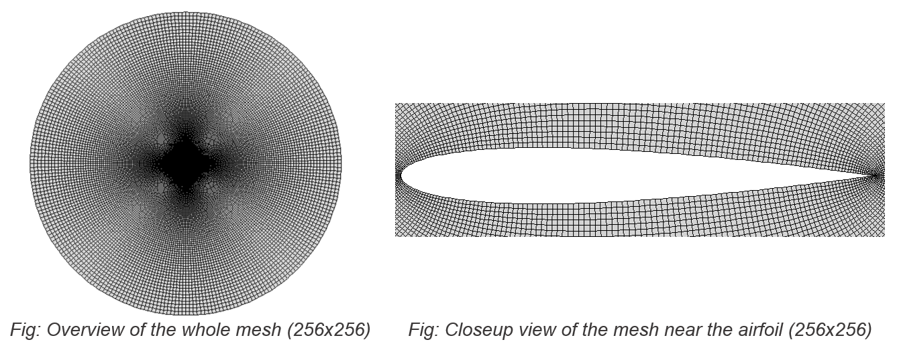
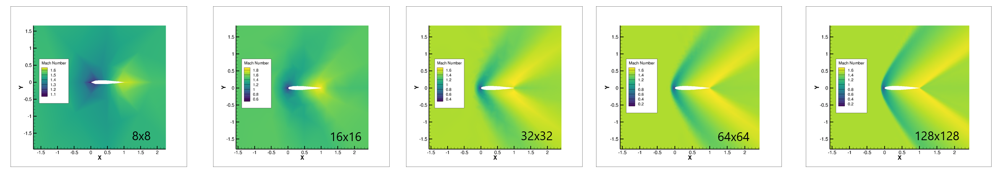
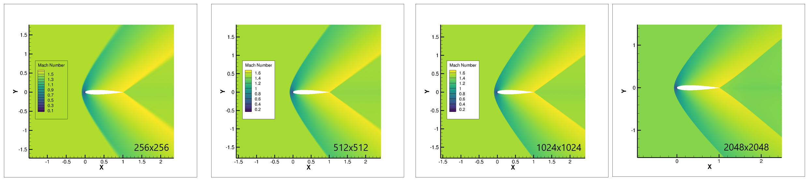
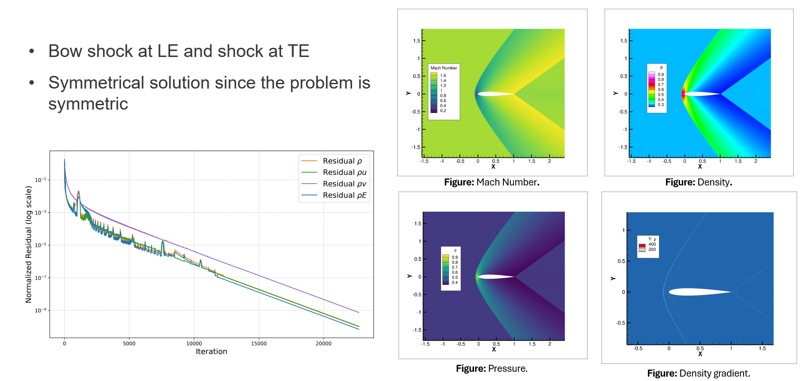
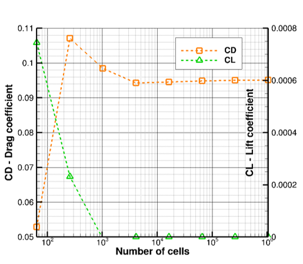
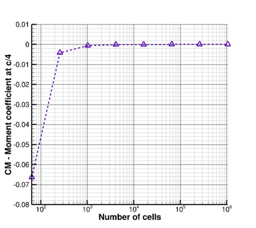

# PyEuler2D
Authors: ```Paramvir Lobana``` | ```Corentin Latimier``` | ```Tristan Defer``` \
Program written for the course: ```Transonic Aerodynamics``` ```Fall 2024``` ```Polytechnique Montreal```


## Decription

**Type of CFD Solver:** structured, cell-centered \
**Numerical Methods:**
1. Flux discretization: **Central scheme with Artificial Dissipation** (order 1,2)
2. Time integration: Explicit Euler (order 1), RK2 (order 2) and RK4 (order 4)
3. Global and local time stepping.

**Inputs:** Mesh (plot3D format), AOA, Mach number, Numerical Parameters\
**Outputs:** Flow solution (.dat file), $C_L$, $C_D$, $C_{M_{c/4}}$ coefficients, residuals evolution, $C_p$ curve, computational time.

One of the meshes used for the simulation is prsented below:

<div style="text-align: center;">
  
</div>

<br />

**Complete presentation can be found here:** [Presentation](resources/assets/presentation.pdf)

## Results
All the results in this section are presented for the supersonic case. However, the program is able to handle all subsonic, transonic and supersonic flow cases.
The contours for the mach number are presented below:

<div style="text-align: center;">
  
</div>
<br />
<div style="text-align: center;">
  
</div>

<br />

### Analysis of Results for the 1024x1024 Grid

The results for the 1024 X 1024 grid case are presented below:

<div style="text-align: center;">
  
</div>

<br />


#### Observations:
- **Bow Shock**:
  - A clear bow shock is visible at the leading edge (LE).
  - The trailing edge (TE) exhibits a shock pattern as well.
- **Symmetry**:
  - The results demonstrate a symmetrical solution, consistent with the symmetry of the problem.

#### Figures:
1. **Top-Left**: **Mach Number**
   - Displays the variation of Mach number around the airfoil, indicating the bow shock at LE and downstream patterns.
2. **Top-Right**: **Density**
   - Highlights the density distribution, with clear regions of compressed and rarefied flow.
3. **Bottom-Left**: **Pressure**
   - Shows the pressure field around the airfoil, correlating with the flow features observed.
4. **Bottom-Right**: **Density Gradient**
   - Depicts the density gradient, emphasizing high-gradient regions near the shock structures.

#### Residuals Plot:
- The bottom-left plot shows the **normalized residuals** over iterations for different variables (ρ, ρu, ρv, ρE).
- Convergence is achieved as residuals decrease exponentially, validating numerical stability and solution accuracy.


### Grid Convergence

The grid convergence results are presented below for $C_L$, $C_D$ and $C_M$:

<div style="display: flex; justify-content: center; gap: 20px;">
  <div style="text-align: center;">
    
    <br />
  </div>
  <div style="text-align: center;">
    
    <br />
  </div>
</div>
